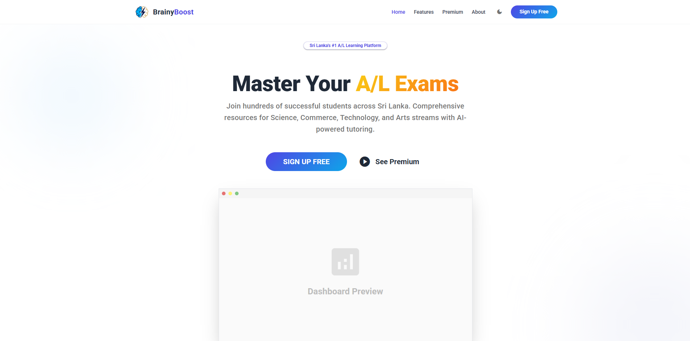
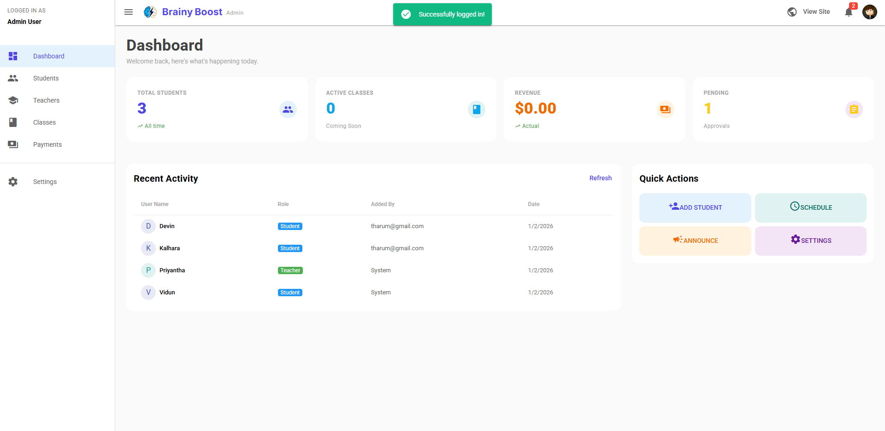
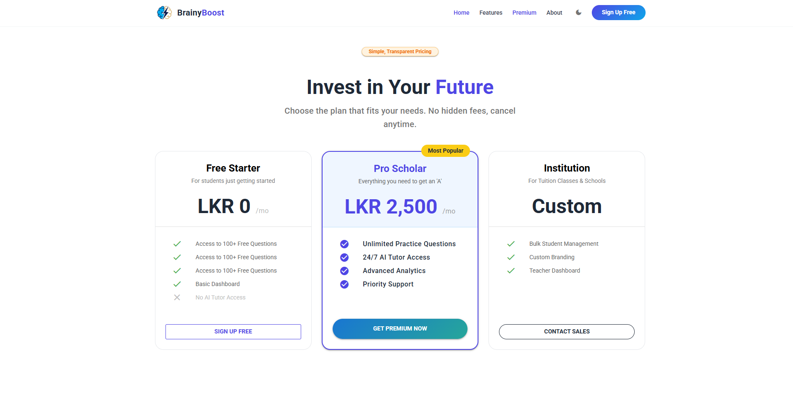

# BrainyBoost - Sri Lanka's #1 A/L Learning Platform

BrainyBoost is a comprehensive learning management system designed specifically for Sri Lankan A/L students across Science, Commerce, Technology, and Arts streams. It features an AI-powered tutoring system and a robust administrative dashboard for managing tuition classes.

## 🚀 Features

- **Student Dashboard:** Track progress and access resources.
- **Admin Panel:** Manage students, teachers, classes, and payments.
- **AI Tutoring:** Integrated AI assistance for exam preparation.
- **Cross-Platform:** Built with Quasar for Web, Mobile, and Desktop support.

## 📸 Screenshots

### Landing Page
Master your A/L exams with our modern interface.


### Administrative Dashboard
Comprehensive overview of students, active classes, and revenue.


### Student Management
Easily track student enrollment and status.


### Flexible Pricing
Plans tailored for individual scholars and large institutions.


## 🛠️ Tech Stack

- **Frontend:** [Quasar Framework](https://quasar.dev/) (Vue.js 3)
- **Backend/Auth:** [Supabase](https://supabase.com/)
- **Build Tool:** Vite

## ⚙️ Installation & Setup

1. **Clone the repository:**
   ```bash
   git clone https://github.com/your-username/BrainyBoost.git
   cd brainyboost